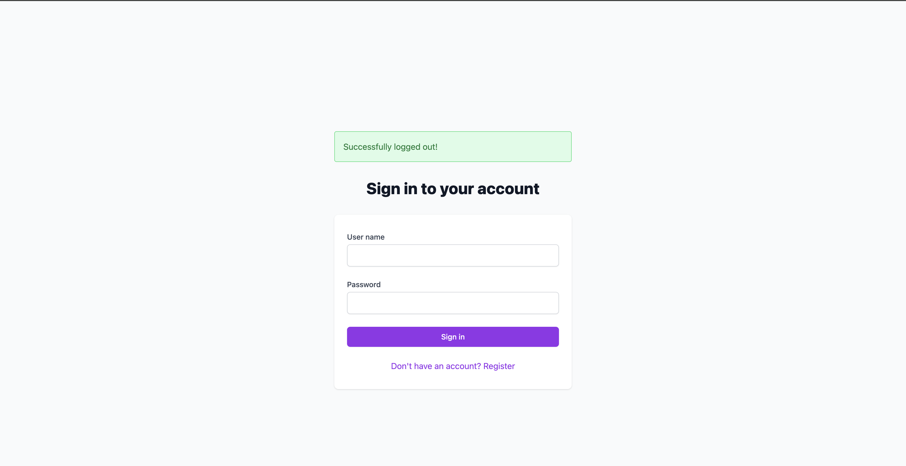
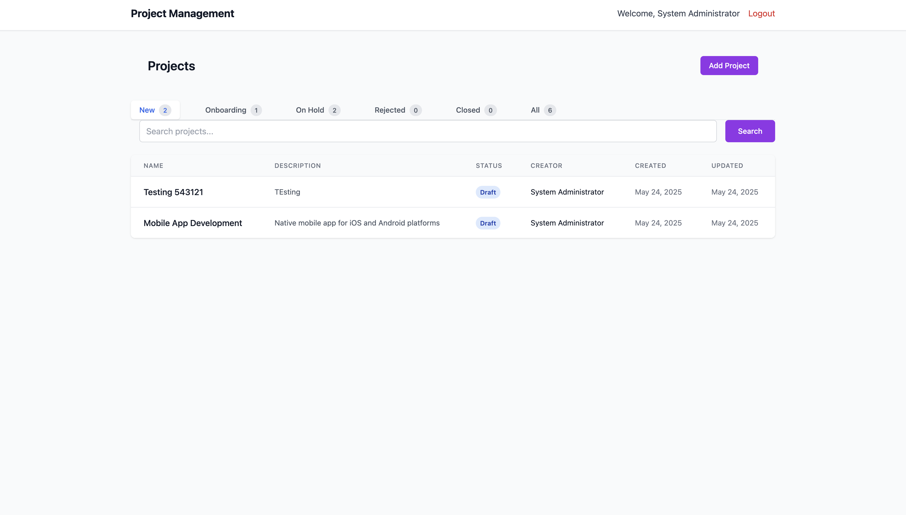
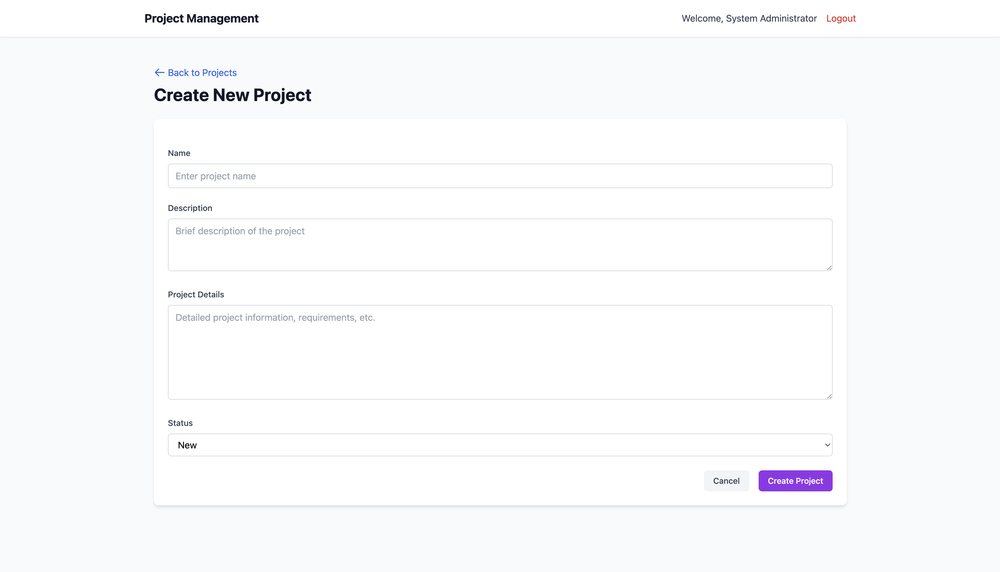
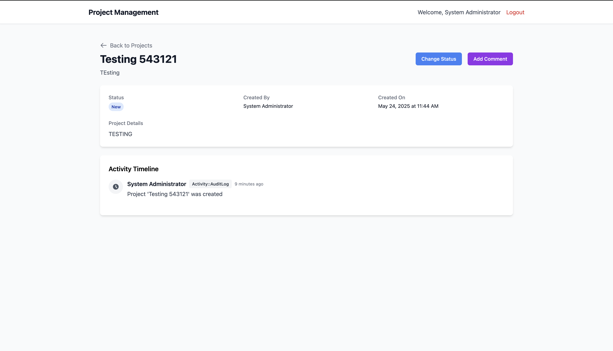
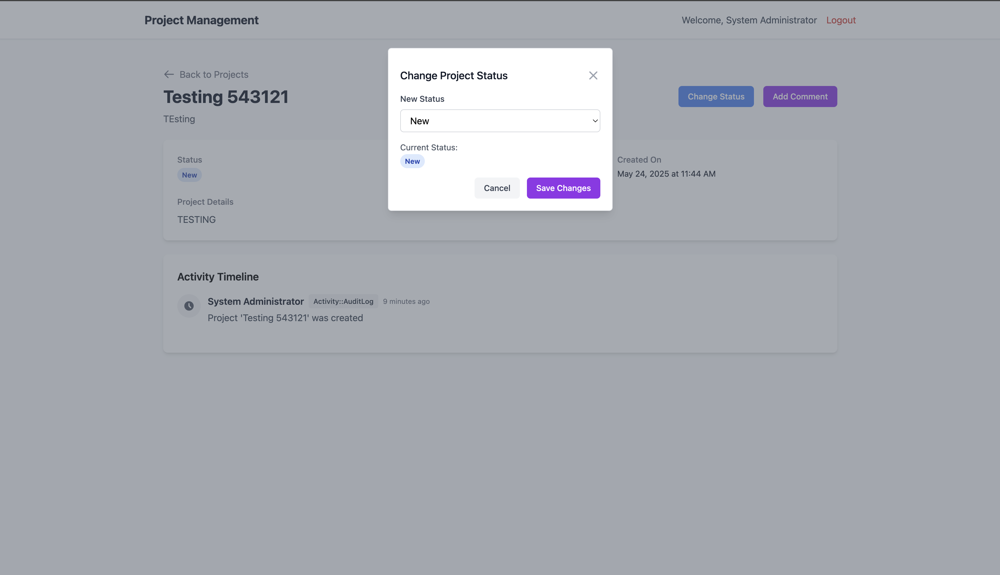
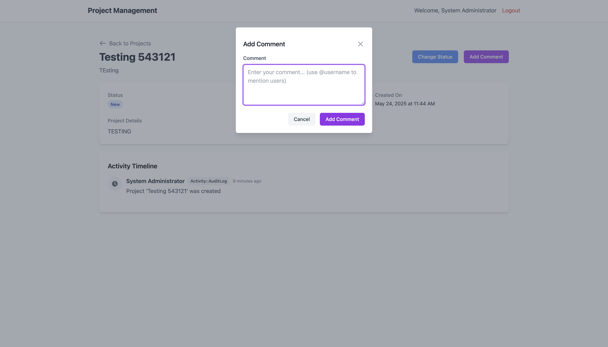

# README

### Requirements: 
- This Project is a Project Conversation History application which lets the users to view the list of projects and their statuses.

- It allows the users to add comments or change the status of the project at the current moment.

- Currently we dont allow project soft deletions as the we expect it to be done by a admin in admin_dashboard (to be build in future)

### Questions from my end to colleagues / product team:

- Can the project ever change name? , If yes do we need to track the project name changes similar to status changes?
- Can the project ever change any other attribute, such as description or content, similarly do we need to track such changes in the history?
- Also who would have the ability to delete the projects or hide them from the predominant users ? 
- Is there any other plans to introduce other type of activity on a project, similar to comment. As we know that sometimes the conversations related to the project happen in phone call. Should we be able to differentiate comment and phone call seperately in next iterations?

### Answers
- At the current MVP, we consider only change in status of project and not other attributes, though support is added code wise to be integrated later in the future.

- The deletion ability is currently not implemented, as we would want to do it in a seperate views altogether which displays more fine details of the project to the admin, and be given the ability only to soft_delete. (Hard delete happens if the user or the client associated with the project leaves our system)

- Yes in the near future we may see more types of activities in the project history list, but for the MVP lets just stick to comment and get iterative feedback from our users.


# Local Setup

## System dependencies:

- Ruby 3.2.2
- Rails 7.2
- Postgresgql@14(local,test) or cockroachdb (for production)


### Configuration:
- Install ruby via rvm with command ```rvm install ruby-3.2.2```


### Database creation:
- Command: ``` rails db:create ```

### Database initialization
- Command: ``` rails db:migrate; rails db:seed; ```

### How to run the test suite
- Command: ``` bundle exec rspec ```

### Start server locally:
- Command: ``` bundle exec rails s ```

### Services (job queues, cache servers, search engines, etc.)
- Right now there is no other services but in future will be adding sidekiq and Elastic search servers for Background jobs and searching capabilities.
- Additionally, since I was not able to get free redis hosting there is no caching of the bearer token. Else bearer token in application controller will be cached for 2-3 minutes

### Deployment instructions:
- The Application is already deployed to https://homey-assignment.onrender.com/login
  ``` admin_username: admin admin_password: password ```
- For other roles, please utilize the seeds.rb file to login as other users.
- Further Plan was to setup a Github CI action to combine it with render workflow to ensure based on merge to main production gets deployed.

### Notes: 
- Due to a bit of time constraint I was able to implement controller test cases for only one controller.
- The deployment part is currently manual , but will be automated with GithubCI or CirleCI to Render/Heroku (chose render as it was the only FREE option :D )
- Some of the UI components are not a bit responsive as I expected, hence would need a bit more time to refactor them to be fully mobile friendly.
- Setup SimpleCov to ensure we have more than atleast 80% test coverage.

### Screenshots:










